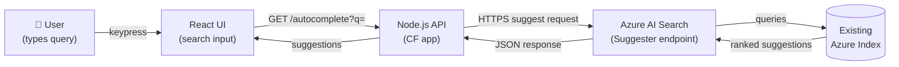
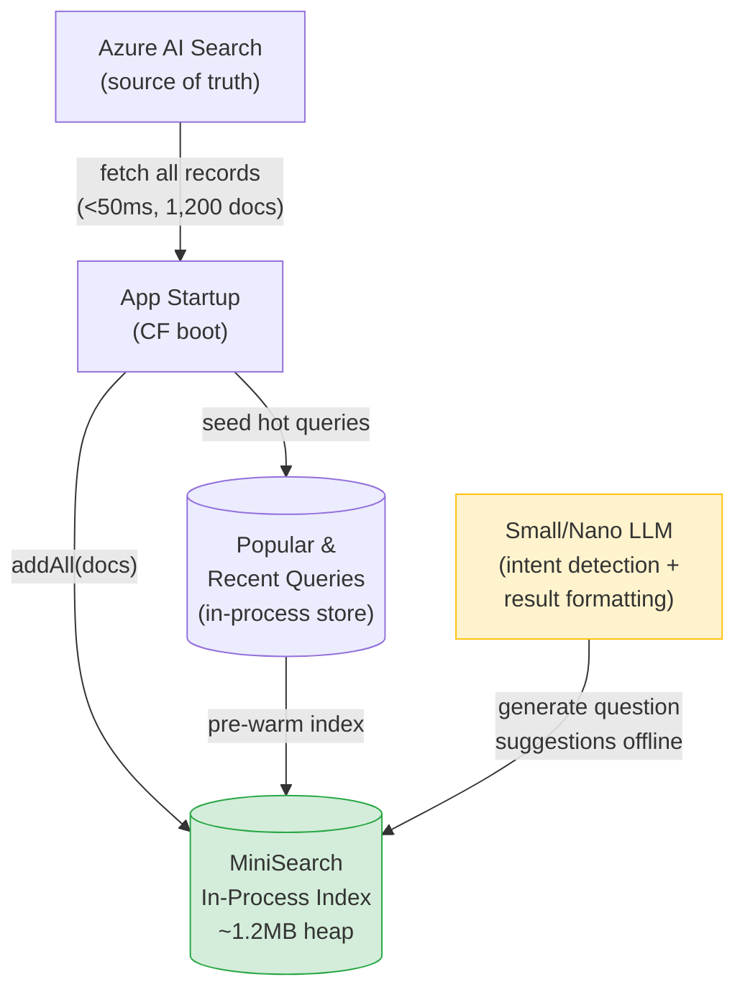
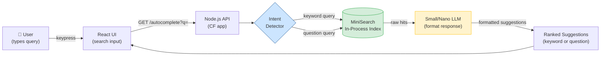
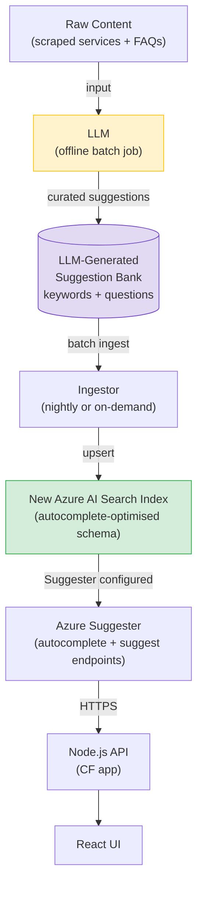
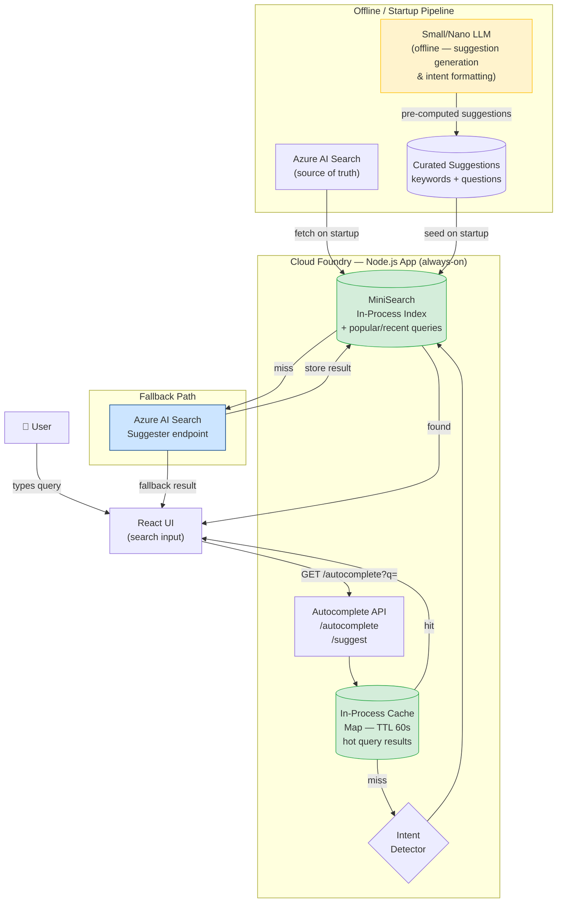

# POC: Search-as-You-Type Autocomplete Capability — Service NSW

> **Status:** POC in progress
> **Author:** TBD
> **Last Updated:** 2026-04-29
> **Confluence Labels:** `poc` `search` `autocomplete` `service-nsw`

---

## 1. Objective

Service NSW requires a **search-as-you-type autocomplete capability** to enhance the citizen-facing search experience on their existing Node.js platform. The goal of this POC is to evaluate feasible approaches end-to-end — from UI to backend to data layer — and showcase a working implementation so that Service NSW can observe real behaviour and define formal requirements from a position of knowledge rather than assumption.

The capability must support two distinct completion modes:

- **Keyword completion** — short service or topic searches (e.g. `renew licence`, `fine payment`)
- **Question completion** — full natural-language queries (e.g. `how do I renew my driver licence?`)

Requirements are intentionally open-ended at this stage. This document captures the approaches trialled, trade-offs discovered, and the proposed architecture direction.

---

## 2. Requirements

### 2.1 Functional Requirements

| # | Requirement |
|---|---|
| F1 | Return autocomplete suggestions as the user types (search-as-you-type) |
| F2 | Support keyword completion for short service/topic searches |
| F3 | Support question completion for natural-language queries |
| F4 | Detect user intent (keyword vs question) and respond accordingly |
| F5 | Support prefix matching — partial input should match full suggestions |
| F6 | Support fuzzy matching — minor typos should still return relevant results |
| F7 | Return a ranked list of suggestions (most relevant first) |

### 2.2 Non-Functional Requirements

| # | Requirement | Target |
|---|---|---|
| NF1 | Low end-to-end latency | P95 < 100ms |
| NF3 | Cost | Minimal |

---

## 3. Approaches & Experiments

### 3.1 Azure Suggester (On Existing Index)

#### Mechanism

Azure AI Search exposes a native **Suggester** feature that can be configured on an existing index to power `autocomplete` and `suggest` endpoints. The existing ingestor already writes to this index. The CF application calls the Azure API over HTTPS.

#### Limitations & Issues

- **Network latency is the bottleneck.** The round-trip from Cloud Foundry (Sydney) to Azure Australia East is ~20–40ms one-way, yielding a P95 end-to-end latency of **40–70ms**. This is within the 100ms SLA but leaves minimal headroom.
- **Existing index schema is not suited for autocomplete.** The indexed chunks are large, resulting in suggestions that are long and semantically meaningless to the end user.

---

### 3.2 MiniSearch + LLM Suggestions

#### Mechanism

MiniSearch is a zero-dependency, in-process full-text search library for Node.js. The entire index lives inside the CF application's heap memory — no network hop, no external service. On startup, the app fetches all records from Azure AI Search and loads them into MiniSearch (`addAll`). Subsequent queries are served sub-millisecond from memory. It also performs intent recognition to determine whether a query is a keyword search or a natural-language question.

For offline data preparation, `title` and `section` fields were fetched from the existing Azure AI Search index and fed into a **small/nano LLM** to generate high-quality, concise suggestions from the raw content.

#### Data Pipeline

#### User Flow

#### Key Characteristics

- **Zero network overhead** — queries never leave the process
- **P95 latency < 1ms** for the search step itself
- **LLM must not be in the hot path** — a live LLM call adds 200–500ms and breaks the SLA. Mitigation: pre-compute suggestions offline/nightly, or use a nano model with sufficiently low inference latency
- **Memory-bound at scale** — not suitable as the primary store if the dataset grows significantly; Azure AI Search remains the source of truth and MiniSearch acts as a fast read cache
- **Effective as a cache layer** — serves the majority of traffic in-process with sub-millisecond latency
- **Popular and frequently-asked queries can be pre-seeded**, enabling MiniSearch to handle ~80% of traffic without ever reaching the network
---

### 3.3 New Azure Search Index (Suggester + LLM-Generated Suggestions)

#### Mechanism

Rather than relying on the existing Azure index schema (which was designed for general search, not autocomplete), this approach creates a **dedicated Azure AI Search index** specifically shaped for autocomplete. An LLM is used **offline** to pre-generate high-quality suggestion strings — both keyword phrases and natural-language questions — which are then ingested into this new index. The Azure Suggester is configured on this cleaner schema, yielding better suggestion quality than querying the raw content index.

#### Key Characteristics

- **Best suggestion quality** — LLM curates meaningful completions rather than surfacing raw field values
- **Decoupled from content index** — the autocomplete index has its own schema, update cadence, and field weights
- **LLM cost is negligible** when run as an offline batch (est. ~AUD $0.05/day with GPT-4o-mini on 1,200 records)
- **Network latency still applies** — P95 40–70ms, same as Approach 3.1
- **Operational overhead** — requires maintaining a second Azure index and an LLM batch pipeline
- **POC scope limited to `title` and `section` fields** — whether full page content should also be considered for suggestion generation is an open question to be discussed with the team

---

## 4. Proposed Architecture

### 4.1 Overview

The proposed production architecture combines **MiniSearch as a hot cache layer** with **Azure AI Search as the authoritative fallback**, with an offline LLM pipeline generating high-quality suggestions that seed the MiniSearch index.

### 4.2 Request Flow Summary

1. User types → UI fires `GET /suggestions?q=`
2. In-process cache checked (TTL 60s) → **hit** returns immediately (<1ms)
3. Cache miss → intent detector classifies query (keyword vs question)
4. MiniSearch queried — prefix + fuzzy match across seeded index
5. MiniSearch hit → result returned and cached
6. MiniSearch miss → fallback to Azure AI Search Suggester
7. Azure result returned, stored in MiniSearch for future requests

### 4.3 MiniSearch Alternatives Comparison

| Option | Latency P95 | Cost/mo (AUD) | CF Deployment | Autocomplete Native | Ops Burden | Verdict |
|---|---|---|---|---|---|---|
| **RediSearch** *(proposed)* | <1ms | $0 | In-process (npm pkg) | Yes (prefix + fuzzy) | Zero | ✅ Recommended |

**MiniSearch memory ceiling:** Safe to ~200,000 records on a 512MB CF instance (current dataset of 1,200 records uses ~1.2MB — 166× headroom). When the dataset approaches this threshold, Typesense is the documented upgrade path with minimal code change.

---

## 5. Pros and Cons

| Criterion | Azure Suggester (Existing Index) | MiniSearch + LLM | New Azure Index + LLM |
|---|---|---|---|
| **Latency P95** | 40–70ms (network-bound) | <1ms (in-process) | 40–70ms (network-bound) |
| **Setup effort** | Low — existing index, wire endpoint | Medium — startup indexer + LLM pipeline | High — new index, schema design, LLM batch |
| **Suggestion quality** | Raw field values | LLM-curated (if pre-computed) | LLM-curated (best quality) |
| **Data freshness** | Real-time (ingestor writes directly) | On startup / redeploy | Batch LLM refresh cadence |
| **Cost** | ~$0–10/mo incremental | $0 (+ LLM batch ~$0.05/day) | ~$0–10/mo + LLM batch |
| **Infrastructure** | None new | None new | New Azure index required |
| **Fallback resilience** | No local fallback | Azure as fallback | No local fallback |
| **Ops burden** | Very low | Zero (search) + LLM pipeline | Low + LLM pipeline |
| **Scalability** | Unlimited (managed) | ~200k records in-process | Unlimited (managed) |
| **Intent awareness** | Not built-in | Yes (intent detector + LLM) | Partial (via index schema) |

---

## 6. Evaluated Alternatives

### Amazon OpenSearch (Rejected)

**What it is:** AWS-managed Elasticsearch-compatible search service deployed in AWS Sydney region.

**Why rejected:**
- AUD $70–150/month — most expensive option with no meaningful advantage for 1,200 records
- Requires a net-new parallel ingestor write path (existing pipeline only writes to Azure)
- Complex Elasticsearch DSL query configuration — highest learning curve of all options
- Network latency still dominates (20–30ms to AWS Sydney), yielding P95 of 40–80ms — no better than Azure
- Adds an AWS dependency to an otherwise Azure/CF stack

### Typesense (Not rejected — deferred as upgrade path)

**What it is:** Open-source, single-binary search engine purpose-built for autocomplete; deployed on CF via binary buildpack.

**Why deferred (not rejected):**
- AUD $20–30/month CF compute cost is acceptable but unnecessary while dataset is small
- Requires a separate CF app deployment (binary buildpack) — additional operational surface
- At 1,200 records, MiniSearch is strictly simpler and faster with zero cost
- **Documented upgrade path:** when the dataset exceeds ~200,000 records and MiniSearch's memory ceiling is approached, Typesense is the natural migration. The startup-indexer pattern is identical; only the search client changes.

### Algolia (Rejected)

**Why rejected:** Algolia is a third-party managed search cloud. Since the existing search API is already built on Azure AI Search, introducing a separate cloud provider purely for autocomplete suggestions adds unnecessary vendor and operational complexity with no meaningful advantage over the Azure-native or in-process alternatives.
---

## 7. Cost Analysis

Costs for the **proposed architecture** (MiniSearch + Azure AI Search fallback + offline LLM):

| Component | Monthly Cost (AUD) | Notes |
|---|---|---|
| MiniSearch (npm package) | $0 | Zero infrastructure |
| Additional CF compute | $0 | Runs inside existing Node.js CF app |
| Azure AI Search (fallback) | $0–10 incremental | Existing tier already paid; fallback usage is low |
| LLM batch (suggestion generation) | ~$1–2 | Nightly GPT-4o-mini batch over ~1,200 records; est. $0.05/day |
| **Total** | **~$1–12/mo** | |

**Comparison against alternatives:**

| Architecture | Monthly Cost (AUD) |
|---|---|
| Proposed (MiniSearch + Azure fallback + LLM batch) | ~$1–12 |
| Azure Suggester only | $0–10 |
| Typesense + Azure fallback | $20–40 |
| Amazon OpenSearch | $70–150 |

---

## 8. Things to Consider

### Scalability
- MiniSearch is safe to ~200,000 records on a 512MB CF instance. At 1,200 records we have 166× headroom.
- If the dataset grows significantly, migration to Typesense is the documented path — the startup-indexer interface is identical, only the client library changes.
- Azure AI Search fallback scales transparently (fully managed by Microsoft).

### Latency
- MiniSearch P95 is <1ms — well within budget even accounting for network overhead from CF to the client.
- **LLM calls must never be in the hot path.** Any LLM involvement must be pre-computed offline or async. A live LLM call adds 200–500ms and immediately breaks the 100ms SLA.
- Azure fallback adds 40–70ms when triggered. Cache hits prevent this for repeat or popular queries.

### Cache Warming (Multi-Instance)
- Each CF instance maintains its own in-process MiniSearch index and in-process query cache.
- On restart or scale-out, the index is cold until warmed by real traffic or a startup pre-warm step.
- **To investigate:** strategy for pre-warming the cache across multiple CF instances (e.g. seeding popular queries at startup from a shared store).

### Data Freshness
- MiniSearch index is rebuilt from Azure on every CF restart/redeploy.
- Between restarts, the index can become stale if the Azure content is updated.
- **To investigate:** scheduled re-index (e.g. nightly `addAll` refresh without a full restart) vs accepting staleness until next deploy.

### Intent Detection
- Rules-based classification (regex on question words + word count) is fast and free but brittle for edge cases.
- A nano LLM can handle ambiguous queries more gracefully but introduces latency and cost.
- The right balance depends on how much edge-case handling Service NSW requires — TBD post-requirements definition.

### Maintenance
- MiniSearch: zero maintenance (npm package, no external service to monitor).
- Azure fallback: existing SRE process covers this (already monitored for main search).
- LLM batch pipeline: nightly job, low maintenance — but needs alerting if it fails silently.

### Data Quality
- LLM-generated suggestions will require an evaluation framework — test cases or human review to validate suggestion quality before production use.
- Whether full page content (beyond `title` and `section`) should feed into suggestion generation is yet to be determined.
- Personalised suggestions are out of scope for the POC but worth considering as a future enhancement.

---

## 9. Open Questions

| # | Question | Owner | Status |
|---|---|---|---|
| OQ3 | What does a "good" suggestion look like — service title, full question, URL? | Product Owner / UX | TBD |
| OQ4 | Minimum character threshold before suggestions fire? | Product Owner / UX | TBD |
| OQ5 | How many suggestions should be displayed at once? | UX | TBD |
| OQ6 | How frequently is the Azure index updated — daily, hourly, real-time? | Ingestor team | TBD |
| OQ11 | Intent detection — is rules-based classification sufficient, or is a nano LLM required? | Engineering | TBD after POC |
| OQ12 | What is the expected latency target for production — is P95 < 100ms sufficient or is a tighter SLA required? | Engineering / Product Owner | TBD |

---

*This document will be updated as the POC progresses and requirements are formalised.*
