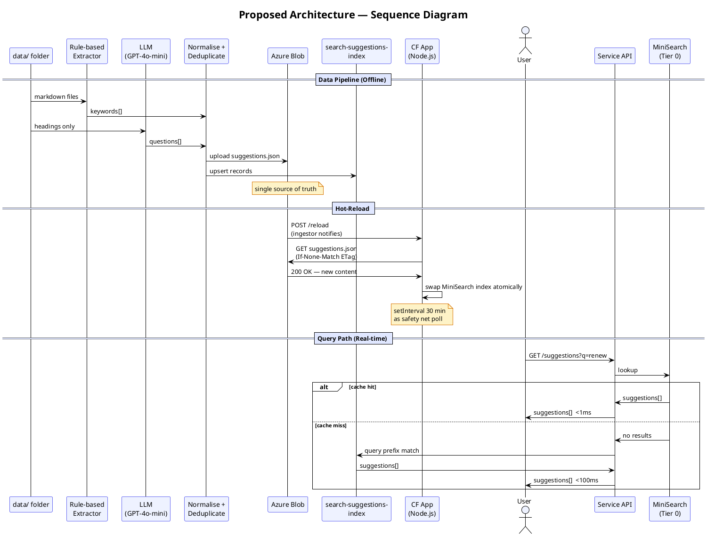

# Slide 5 — Proposed Architecture in Full

## Title
Bringing It All Together — The Complete Autocomplete System

## Description
The proposed architecture closes every gap identified in the POC. It is composed of two independent parts that work together — a data pipeline that prepares and keeps suggestions fresh, and a query path that serves them at speed.

---

## Part 1 — Data Pipeline

```
NSW Gov Websites
      │
      ▼
Fetch & Convert to Markdown
      │
      ▼
data/ folder (git repo)
      │
      ├─────────────────────────────────────────┐
      ▼                                         ▼
Primary Pipeline                     Suggestions Pipeline
(unchanged)                                     │
      │                          ┌──────────────┴──────────────┐
      ▼                          ▼                             ▼
search-index            Rule-based Extraction          LLM Extraction
(Azure AI Search)       (headings, lists,              (headings only →
                         related links)                 GPT-4o-mini)
                                 │                             │
                                 └──────────────┬─────────────┘
                                                ▼
                                    Normalise + Deduplicate
                                                │
                                 ┌──────────────┴──────────────┐
                                 ▼                             ▼
                          Azure Blob                search-suggestions-index
                        (suggestions.json)           (Azure AI Search)
```

---

## Part 2 — Query Path

```
User types
      │
      ▼
GET /suggestions  (Service API · Node.js CF)
      │
      ▼
MiniSearch  (Tier 0 — in-memory)
      │
      ├── Hit  ──→  return suggestions  (<1ms)
      │
      └── Miss ──→  search-suggestions-index  (Tier 1 · Azure AI Search)
                          │
                          └──→  return suggestions  (<100ms)
```

---

## Part 3 — Keeping Suggestions Fresh (Hot-Reload)

```
Ingestor uploads new suggestions.json to Azure Blob
      │
      ├──→  POST /reload  →  immediate index swap  (all instances via pub/sub)
      │
      └──→  setInterval poll  (30 min · ETag check · safety net)
```

---

## Full Picture

| Concern | Solution |
|---|---|
| Suggestion quality | LLM refinement + rule-based extraction from markdown |
| Latency | MiniSearch tier 0 (sub-ms) + Azure AI Search tier 1 (<100ms) |
| Data freshness | Azure Blob hot-reload via pub/sub or polling |
| Cost | No always-on DB · LLM on headings only · ETag polling |
| Scale | MiniSearch → RediSearch swap-in as instances grow |
| Popular queries | Frequently asked questions feedable into MiniSearch over time |
| Existing pipeline | Zero changes — suggestions pipeline runs alongside |

## Diagrams

### Component Diagram
*(insert data pipeline PlantUML + query flow PlantUML)*

### Sequence Diagram


